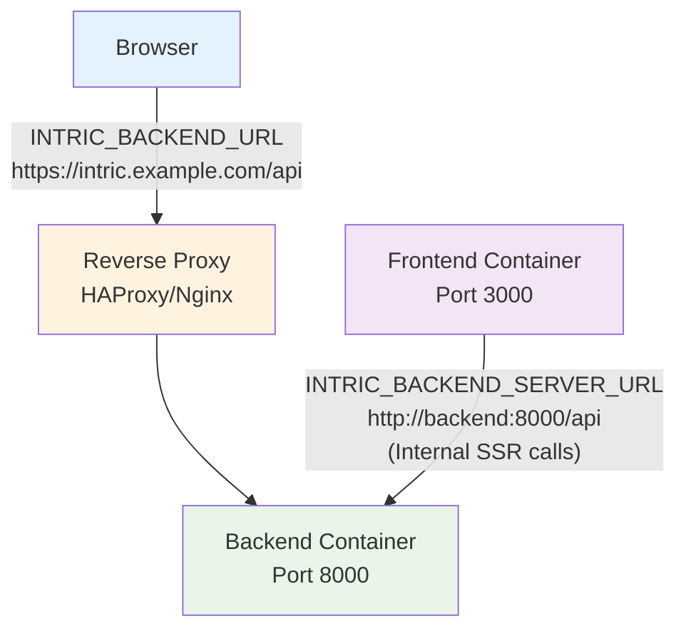

# Intric Production Deployment Guide

## 🚀 Quick Start (10 minutes)

Deploy Intric using pre-built public images from GitHub Container Registry:

```bash
# 1. Create deployment directory
sudo mkdir -p /opt/intric && cd /opt/intric

# 2. Download the example docker-compose.yml
curl -O https://raw.githubusercontent.com/inooLabs/intric-community/main/docker-compose.prod.yml
mv docker-compose.prod.yml docker-compose.yml

# 3. Create environment files (see minimal examples below)
touch .env env_backend env_db env_frontend

# 4. Configure .env with PUBLIC IMAGES (IMPORTANT!)
cat > .env << 'EOF'
# Public images from GitHub Container Registry
BACKEND_IMAGE=ghcr.io/inoolabs/intric-community-backend
FRONTEND_IMAGE=ghcr.io/inoolabs/intric-community-frontend
BACKEND_TAG=latest
FRONTEND_TAG=latest

# Port configuration
BACKEND_PORT=8000
FRONTEND_PORT=3000

# Database and Redis (always available)
DB_IMAGE=pgvector/pgvector
DB_TAG=pg16
REDIS_IMAGE=redis
REDIS_TAG=latest
EOF

# 5. Configure minimal env_backend (CHANGE SECRETS!)
cat > env_backend << 'EOF'
# REQUIRED: Add at least one AI provider key
OPENAI_API_KEY=sk-...  # Replace with your actual key

# REQUIRED: Security - MUST CHANGE THESE!
JWT_SECRET=change-me-$(openssl rand -hex 32)
URL_SIGNING_KEY=change-me-$(openssl rand -hex 32)

# REQUIRED: Infrastructure (don't change these)
POSTGRES_HOST=db
POSTGRES_PORT=5432
POSTGRES_USER=postgres
POSTGRES_PASSWORD=postgres
POSTGRES_DB=postgres
REDIS_HOST=redis
REDIS_PORT=6379

# REQUIRED: Default settings
JWT_AUDIENCE=*
JWT_ISSUER=INTRIC
JWT_EXPIRY_TIME=86400
JWT_ALGORITHM=HS256
API_PREFIX=/api/v1
API_KEY_LENGTH=64
UPLOAD_FILE_TO_SESSION_MAX_SIZE=1048576
UPLOAD_IMAGE_TO_SESSION_MAX_SIZE=1048576
UPLOAD_MAX_FILE_SIZE=10485760
TRANSCRIPTION_MAX_FILE_SIZE=10485760
MAX_IN_QUESTION=1
EOF

# 6. Configure env_db
cat > env_db << 'EOF'
POSTGRES_USER=postgres
POSTGRES_PASSWORD=postgres
POSTGRES_DB=postgres
EOF

# 7. Configure env_frontend
cat > env_frontend << 'EOF'
# Update domain for production!
ORIGIN=http://localhost:3000
INTRIC_BACKEND_URL=http://localhost:8000
INTRIC_BACKEND_SERVER_URL=http://backend:8000

# Must match backend JWT_SECRET
JWT_SECRET=change-me-$(openssl rand -hex 32)
EOF

# 8. Set permissions and create data directories
sudo chmod 600 env_*
sudo mkdir -p data/{backend,pgvector,redis}
sudo chown -R 999:999 data/

# 9. Deploy!
docker compose up -d

# 10. Verify (wait ~30 seconds for initialization)
docker compose ps
curl http://localhost:8000/version
```

### ✅ Common Issues and Solutions

**"manifest unknown" or "pull access denied" error?**
- Your `.env` file has incorrect image names
- Verify `BACKEND_IMAGE=ghcr.io/inoolabs/intric-community-backend`
- NOT `BACKEND_IMAGE=intric-backend` or similar

**Still having issues?** Build from source:
```bash
git clone https://github.com/inooLabs/intric-community.git
cd intric-community
docker build -t intric-backend:latest ./backend
docker build -t intric-frontend:latest ./frontend

# Update .env to use local images:
BACKEND_IMAGE=intric-backend
FRONTEND_IMAGE=intric-frontend
```

### 💻 Development Setup (5 minutes)
```bash
# Option 1: Devcontainer (Recommended)
git clone https://github.com/inooLabs/intric-community.git
cd intric-community && code .  # VS Code will prompt to open in container

# Option 2: Local Development
git clone https://github.com/inooLabs/intric-community.git
cd intric-community/backend && docker compose up -d  # Start PostgreSQL + Redis
cp .env.template .env  # Edit with your settings
poetry install && poetry run python init_db.py && poetry run start
# In another terminal: cd ../frontend && pnpm install && pnpm -w run dev
```

## Production Deployment Checklist

**Prerequisites:**
- [ ] Linux server with 4GB+ RAM, 50GB+ storage
- [ ] Container runtime: Podman (recommended) or Docker
- [ ] At least one AI provider API key
- [ ] SSL certificate (if using HTTPS)

**Deployment Steps:**
- [ ] **Install Runtime**: `podman` + `podman-compose` (or Docker equivalent)
- [ ] **Create Directory**: `sudo mkdir -p /opt/intric-production`  
- [ ] **Environment Files**: Configure `.env`, `env_backend`, `env_db`, `env_frontend`
- [ ] **Security**: Change `JWT_SECRET`, `URL_SIGNING_KEY`, database passwords
- [ ] **AI Models**: Set API keys (OpenAI, Anthropic, Azure, etc.)
- [ ] **Permissions**: `sudo chmod 600 env_* && sudo chown -R 999:999 data/`
- [ ] **Deploy**: `podman-compose up -d` (or `docker-compose up -d`)
- [ ] **Verify**: Check services and API endpoint
- [ ] **Reverse Proxy**: Configure HAProxy/Nginx for SSL (optional)
- [ ] **Firewall**: Allow 80/443, secure internal ports
- [ ] **Monitoring**: Set up log rotation and backups

**Container Runtime Options:**
- **Podman** (recommended for RHEL/CentOS): Rootless, systemd integration
- **Docker**: Works identically, replace `podman-compose` with `docker-compose`
- **Kubernetes**: Use provided Helm charts for cluster deployment

**Reverse Proxy Options:**
- **HAProxy** (example provided): Used by Sundsvall municipality
- **Nginx**: Popular alternative with similar configuration
- **Traefik**: Automatic SSL with Let's Encrypt
- **None**: Expose services directly (development only)

## Architecture Overview
- **Core Stack**: Frontend (SvelteKit) + Backend (FastAPI) + Worker (ARQ) + PostgreSQL + Redis
- **Container Orchestration**: podman-compose for service management  
- **Load Balancing**: HAProxy for SSL termination (example configuration provided)
- **Target Environment**: RHEL8 with SELinux (adaptable to other Linux distributions)

This guide provides production-ready deployment instructions with real-world examples.

## Table of Contents
- [Architecture Overview](#architecture-overview)
- [Prerequisites](#prerequisites)
- [Environment Variables](#environment-variables)
- [Production Deployment with Podman Compose](#production-deployment-with-podman-compose)
- [HAProxy Configuration](#haproxy-configuration)
- [RHEL8 Specific Setup](#rhel8-specific-setup)
- [Development Setup](#development-setup)
- [Maintenance](#maintenance)
- [Troubleshooting](#troubleshooting)

## Architecture Overview

Production deployment consists of:
1. **HAProxy** - SSL termination and load balancing (port 80/443)
2. **Frontend** - SvelteKit server (port 3000)
3. **Backend API** - FastAPI server (port 8000)
4. **Worker** - ARQ background task processor
5. **Database** - PostgreSQL 16 with pgvector extension
6. **Cache/Queue** - Redis for caching and job queues

All services run as containers managed by podman-compose with persistent data volumes.

## Prerequisites

### System Requirements
- **OS**: RHEL8 (recommended) or compatible Linux distribution
- **Container Runtime**: Podman with podman-compose (or Docker as alternative)
- **RAM**: Minimum 4GB, recommended 8GB+ for production
- **Storage**: Minimum 50GB for production data and container images
- **CPU**: 2+ cores recommended
- **Network**: DNS pointing to the server, valid SSL certificate

### Required Software
- **Podman** with podman-compose for container orchestration
- **HAProxy** for SSL termination and load balancing
- **SELinux** and firewall configuration (RHEL8 specific)
- **systemd** for service management and autostart

### Container Images

**✅ Public Images (Recommended)**

Intric provides public container images on GitHub Container Registry:

```bash
# Backend image
docker pull ghcr.io/inoolabs/intric-community-backend:latest

# Frontend image  
docker pull ghcr.io/inoolabs/intric-community-frontend:latest

# These are configured in your .env file:
BACKEND_IMAGE=ghcr.io/inoolabs/intric-community-backend
FRONTEND_IMAGE=ghcr.io/inoolabs/intric-community-frontend
```

**Alternative: Build from Source**

If you need custom modifications or the public images aren't working:

```bash
# Clone and build your own images
git clone https://github.com/inooLabs/intric-community.git
cd intric-community

# Build backend
docker build -t intric-backend:latest ./backend

# Build frontend  
docker build -t intric-frontend:latest ./frontend

# Update .env to use local images:
BACKEND_IMAGE=intric-backend
FRONTEND_IMAGE=intric-frontend
```

**Infrastructure Images (Always Available):**
- PostgreSQL 16 with pgvector: `pgvector/pgvector:pg16`
- Redis: `redis:latest`

### External Dependencies
- At least one AI model provider API key (OpenAI, Anthropic, Azure, etc.)
- SMTP server for email notifications (optional)
- External authentication provider (MobilityGuard/Zitadel, optional)

## Environment Variables

Intric uses multiple environment files for configuration. All values must be properly set for production deployment.

### `.env` - Container Images and Ports

**IMPORTANT: Use the correct image names to avoid "manifest unknown" errors!**

```bash
# Container Images - Use PUBLIC images from GitHub Container Registry
BACKEND_IMAGE=ghcr.io/inoolabs/intric-community-backend
FRONTEND_IMAGE=ghcr.io/inoolabs/intric-community-frontend
BACKEND_TAG=latest
FRONTEND_TAG=latest

# Port configuration
BACKEND_PORT=8000
FRONTEND_PORT=3000

# Database and Cache Images (Always Available)
DB_IMAGE=pgvector/pgvector
DB_TAG=pg16
REDIS_IMAGE=redis
REDIS_TAG=latest

# Alternative: If building from source
# BACKEND_IMAGE=intric-backend
# FRONTEND_IMAGE=intric-frontend
```

### `env_db` - Database Configuration

Shared by backend, worker, and db-init services:

```bash
# PostgreSQL Connection (REQUIRED)
POSTGRES_USER=postgres          # Database username
POSTGRES_PASSWORD=secure_pass   # Database password - CHANGE IN PRODUCTION
POSTGRES_HOST=db               # Container hostname (use 'db' for compose)
POSTGRES_PORT=5432             # Database port
POSTGRES_DB=postgres           # Database name
```

### `env_backend` - Backend and Worker Configuration

Extensive configuration for API and background workers:

```bash
# ============================================================================
# AI MODEL PROVIDERS (At least one required)
# ============================================================================

# OpenAI Configuration
OPENAI_API_KEY=sk-...          # OpenAI API key

# Anthropic Configuration  
ANTHROPIC_API_KEY=sk-ant-...   # Anthropic Claude API key

# Azure OpenAI Configuration
USING_AZURE_MODELS=True        # Enable Azure models
AZURE_API_KEY=abc123...        # Azure OpenAI API key
AZURE_ENDPOINT=https://...     # Azure OpenAI endpoint URL
AZURE_API_VERSION=2023-12-01-preview  # Azure API version

# Custom Model Endpoints  
INFINITY_URL=                  # Infinity embedding endpoint (for E5 models, optional)
VLLM_MODEL_URL=               # VLLM completion model endpoint (optional)

# Additional AI Providers (optional)
OVHCLOUD_API_KEY=             # OVHCloud API key
MISTRAL_API_KEY=              # Mistral API key
TAVILY_API_KEY=               # Tavily web search API key

# ============================================================================
# INFRASTRUCTURE DEPENDENCIES (REQUIRED)
# ============================================================================

# Redis Configuration
REDIS_HOST=redis              # Redis hostname (use 'redis' for compose)
REDIS_PORT=6379              # Redis port

# ============================================================================
# SECURITY CONFIGURATION (ALL REQUIRED)
# ============================================================================

# JWT Token Configuration
JWT_SECRET=CHANGE_ME_PRODUCTION    # Secret for JWT signing - CHANGE IN PRODUCTION
JWT_AUDIENCE=*                     # JWT audience claim
JWT_ISSUER=EXAMPLE                # JWT issuer claim  
JWT_EXPIRY_TIME=86000             # Token expiry in seconds (24h)
JWT_ALGORITHM=HS256               # JWT signing algorithm
JWT_TOKEN_PREFIX=                 # JWT token prefix (optional)

# API Configuration
API_PREFIX=/api/v1               # API route prefix
API_KEY_LENGTH=64               # Generated API key length
API_KEY_HEADER_NAME=            # Custom API key header name (optional)

# URL Signing
URL_SIGNING_KEY=CHANGE_ME       # Key for signing URLs - CHANGE IN PRODUCTION

# ============================================================================
# FILE UPLOAD LIMITS (REQUIRED)
# ============================================================================

# Upload Size Limits (in bytes)
UPLOAD_FILE_TO_SESSION_MAX_SIZE=1048576      # 1MB - Files uploaded to chat
UPLOAD_IMAGE_TO_SESSION_MAX_SIZE=1048576     # 1MB - Images uploaded to chat  
UPLOAD_MAX_FILE_SIZE=10485760                # 10MB - General file uploads
TRANSCRIPTION_MAX_FILE_SIZE=10485760         # 10MB - Audio files for transcription
MAX_IN_QUESTION=1                            # Max files per question

# ============================================================================
# FEATURE FLAGS (Configure as needed)
# ============================================================================

# Access Management
USING_ACCESS_MANAGEMENT=True                 # Enable role-based access control

# Model Features  
USING_AZURE_MODELS=True                     # Enable Azure OpenAI models (duplicate of above)
USING_CRAWL=true                            # Enable web crawling feature

# ============================================================================
# AUTHENTICATION INTEGRATION (Optional)
# ============================================================================

# MobilityGuard/Zitadel OIDC Integration
MOBILITYGUARD_DISCOVERY_ENDPOINT=https://...  # OIDC discovery endpoint
MOBILITYGUARD_CLIENT_ID=client_id             # OIDC client ID
MOBILITYGUARD_CLIENT_SECRET=client_secret     # OIDC client secret

# ============================================================================
# LOGGING (Optional)
# ============================================================================

# Application Logging
LOGLEVEL=INFO                    # Log level: DEBUG, INFO, WARNING, ERROR
```

### `env_frontend` - Frontend Configuration

SvelteKit application configuration:

```bash
# ============================================================================
# FRONTEND CORE CONFIGURATION (REQUIRED)
# ============================================================================

# Application URLs
ORIGIN=https://intric.example.com               # Frontend public URL
INTRIC_BACKEND_URL=https://intric.example.com   # Backend URL (public-facing)
INTRIC_BACKEND_SERVER_URL=http://backend:8000   # Backend URL (internal/SSR)

# Security
JWT_SECRET=CHANGE_ME_PRODUCTION                 # Must match backend JWT_SECRET

# ============================================================================
# AUTHENTICATION INTEGRATION (Optional)
# ============================================================================

# OIDC Authentication  
MOBILITY_GUARD_AUTH=https://auth.example.com/   # OIDC provider URL (optional)

# ============================================================================
# FEATURE CONFIGURATION (Optional)
# ============================================================================

# Template System
SHOW_TEMPLATES=true             # Show application templates in UI

# User Feedback
FEEDBACK_FORM_URL=              # URL for feedback form link (optional)

# ============================================================================
# DEPLOYMENT SETTINGS (REQUIRED)
# ============================================================================

# Environment
NODE_ENV=production             # Node.js environment
LOGLEVEL=DEBUG                  # Frontend log level

# TLS Configuration (for internal connections)
NODE_TLS_REJECT_UNAUTHORIZED=0  # Disable TLS verification for internal calls
                                # Use only if INTRIC_BACKEND_SERVER_URL has SSL issues
                                # Better to use http://backend:8000 for internal calls
```

### Configuration Notes

1. **Security Critical**: Always change `JWT_SECRET` and `URL_SIGNING_KEY` from defaults
2. **API Keys**: At least one AI model provider API key is required for functionality
3. **Port Configuration**:
   - `FRONTEND_PORT=3000`: Host port for frontend (container always uses 3000 internally)
   - `BACKEND_PORT=8000`: Host port for backend (container always uses 8000 internally)
   - For multiple instances, use different host ports (e.g., 8001, 8002, 8123) while containers stay on 8000
4. **URL Configuration (Critical for Production)**:
   - `INTRIC_BACKEND_URL`: Public-facing URL that browsers use (e.g., `https://intric.example.com`)
   - `INTRIC_BACKEND_SERVER_URL`: Internal container URL for server-side rendering (e.g., `http://backend:8000`)
   - **Why both are needed**: Frontend container makes two types of calls:
     * **Client-side**: Browser → Reverse Proxy → Backend (uses `INTRIC_BACKEND_URL`)
     * **Server-side**: Frontend Container → Backend Container (uses `INTRIC_BACKEND_SERVER_URL`)
   - **CORS Prevention**: Using internal URL for SSR avoids SSL handshake and proxy overhead
5. **File Permissions**: Environment files should be readable only by the application user (`chmod 600`)
6. **Container Network**: Internal hostnames (`db`, `redis`, `backend`) are used for inter-container communication

## Production Deployment with Podman Compose

This section covers production deployment using podman-compose, as used by Sundsvall municipality and other organizations.

### Directory Structure

Create the following directory structure:

```
/opt/intric-production/
├── data/                    # Persistent data volumes
│   ├── backend/            # Backend file storage
│   ├── pgvector/           # PostgreSQL data
│   └── redis/              # Redis data
├── .env                    # Container images and ports
├── env_backend             # Backend/worker environment
├── env_db                  # Database environment  
├── env_frontend            # Frontend environment
└── podman-compose.yaml     # Service definitions
```

### Volume Permissions

All data volumes must be owned by UID 999 (container user):

```bash
sudo mkdir -p /opt/intric-production/data/{backend,pgvector,redis}
sudo chown -R 999:999 /opt/intric-production/data
sudo chmod -R 755 /opt/intric-production/data
```

### Podman Compose File

Create `/opt/intric-production/podman-compose.yaml`:

```yaml
version: '3.8'

services:
  frontend:
    image: "${FRONTEND_IMAGE}:${FRONTEND_TAG}"
    container_name: intric_frontend
    ports:
      - "127.0.0.1:${FRONTEND_PORT}:3000"
    env_file:
      - ./env_frontend
    restart: unless-stopped
    networks:
      - intric-network
    healthcheck:
      test: ["CMD-SHELL", "(echo >/dev/tcp/127.0.0.1/3000) &>/dev/null"]
      interval: 30s
      timeout: 10s
      retries: 3
      start_period: 40s

  backend:
    image: "${BACKEND_IMAGE}:${BACKEND_TAG}"
    container_name: intric_backend
    ports:
      - "127.0.0.1:${BACKEND_PORT}:8000"  # Maps container port 8000 to host BACKEND_PORT
    env_file:
      - ./env_backend
      - ./env_db
    restart: unless-stopped
    volumes:
      - ./data/backend:/app/data:z
    networks:
      - intric-network
    depends_on:
      db:
        condition: service_healthy
      redis:
        condition: service_healthy
      db-init:
        condition: service_completed_successfully
    healthcheck:
      test: ["CMD-SHELL", "curl -f http://127.0.0.1:8000/version || exit 1"]
      interval: 30s
      timeout: 10s
      retries: 3
      start_period: 20s

  worker:
    image: "${BACKEND_IMAGE}:${BACKEND_TAG}"
    container_name: intric_worker
    command: ["poetry", "run", "arq", "intric.worker.arq.WorkerSettings"]
    env_file:
      - ./env_backend
      - ./env_db
    restart: unless-stopped
    volumes:
      - ./data/backend:/app/data:z
    networks:
      - intric-network
    depends_on:
      backend:
        condition: service_started

  db:
    image: "${DB_IMAGE}:${DB_TAG}"
    container_name: intric_db
    env_file:
      - ./env_db
    volumes:
      - ./data/pgvector:/var/lib/postgresql/data:z
    healthcheck:
      test: ["CMD-SHELL", "pg_isready -U postgres -d postgres"]
      interval: 10s
      timeout: 5s
      retries: 5
      start_period: 10s
    restart: unless-stopped
    networks:
      - intric-network

  redis:
    image: "${REDIS_IMAGE}:${REDIS_TAG}"
    container_name: intric_redis
    volumes:
      - ./data/redis:/data:z
    healthcheck:
      test: ["CMD", "redis-cli", "ping"]
      interval: 10s
      timeout: 5s
      retries: 5
      start_period: 5s
    restart: unless-stopped
    networks:
      - intric-network

  db-init:
    image: "${BACKEND_IMAGE}:${BACKEND_TAG}"
    container_name: intric_db_init
    command: ["python", "init_db.py"]
    env_file:
      - ./env_backend
      - ./env_db
    networks:
      - intric-network
    depends_on:
      db:
        condition: service_healthy

networks:
  intric-network:
```

### Deployment Steps

1. **Create project directory and set permissions**:
   ```bash
   sudo mkdir -p /opt/intric-production
   cd /opt/intric-production
   ```

2. **Create environment files** with the configurations from the Environment Variables section above.
   
   **Quick start example files:**
   
   Create `.env`:
   ```bash
   # Container Images - Use PUBLIC images!
   BACKEND_IMAGE=ghcr.io/inoolabs/intric-community-backend
   FRONTEND_IMAGE=ghcr.io/inoolabs/intric-community-frontend
   BACKEND_TAG=latest
   FRONTEND_TAG=latest
   
   # Port configuration
   BACKEND_PORT=8000
   FRONTEND_PORT=3000
   
   # Database and Redis
   DB_IMAGE=pgvector/pgvector
   DB_TAG=pg16
   REDIS_IMAGE=redis
   REDIS_TAG=latest
   ```
   
   Create minimal `env_backend`:
   ```bash
   # Required - Add at least one AI provider
   OPENAI_API_KEY=sk-...  # or ANTHROPIC_API_KEY=sk-ant-...
   
   # Required - Security (CHANGE THESE!)
   JWT_SECRET=change-me-to-random-string
   URL_SIGNING_KEY=change-me-to-another-random-string
   
   # Required - Keep these defaults
   POSTGRES_HOST=db
   POSTGRES_PORT=5432
   POSTGRES_USER=postgres
   POSTGRES_PASSWORD=postgres
   POSTGRES_DB=postgres
   REDIS_HOST=redis
   REDIS_PORT=6379
   
   # Required - File upload limits
   UPLOAD_FILE_TO_SESSION_MAX_SIZE=1048576
   UPLOAD_IMAGE_TO_SESSION_MAX_SIZE=1048576
   UPLOAD_MAX_FILE_SIZE=10485760
   TRANSCRIPTION_MAX_FILE_SIZE=10485760
   MAX_IN_QUESTION=1
   
   # Required - API settings
   API_PREFIX=/api/v1
   API_KEY_LENGTH=64
   JWT_AUDIENCE=*
   JWT_ISSUER=EXAMPLE
   JWT_EXPIRY_TIME=86000
   JWT_ALGORITHM=HS256
   ```
   
   Create minimal `env_db`:
   ```bash
   POSTGRES_USER=postgres
   POSTGRES_PASSWORD=postgres
   POSTGRES_DB=postgres
   ```
   
   Create minimal `env_frontend`:
   ```bash
   # URLs - adjust domain for production
   ORIGIN=http://localhost:3000
   INTRIC_BACKEND_URL=http://localhost:8000
   INTRIC_BACKEND_SERVER_URL=http://backend:8000
   
   # Must match backend
   JWT_SECRET=change-me-to-random-string
   ```

3. **Set proper file permissions**:
   ```bash
   sudo chmod 600 env_*
   sudo chown -R 999:999 data/
   ```

4. **Deploy with Docker or Podman**:
   ```bash
   # Using Docker Compose
   docker compose up -d
   
   # OR using Podman Compose
   podman-compose up -d
   ```

5. **Verify deployment**:
   ```bash
   # Check container status
   docker compose ps       # or: podman-compose ps
   
   # View logs if needed
   docker compose logs frontend   # or: podman-compose logs frontend
   docker compose logs backend    # or: podman-compose logs backend
   
   # Test backend API
   curl http://localhost:8000/version
   ```

### Systemd Integration

#### Option 1: Simple Systemd Service

For basic setups, create a single systemd service:

```bash
sudo tee /etc/systemd/system/intric.service > /dev/null << 'EOF'
[Unit]
Description=Intric Application Stack
After=network.target
Requires=podman.socket

[Service]
Type=notify
WorkingDirectory=/opt/intric-production
ExecStart=/usr/bin/podman-compose up
ExecStop=/usr/bin/podman-compose down
Restart=always
RestartSec=10

[Install]
WantedBy=multi-user.target
EOF

sudo systemctl daemon-reload
sudo systemctl enable intric.service
sudo systemctl start intric.service
```

#### Option 2: Podman-Compose Systemd Integration (Recommended)

This approach uses podman's native systemd integration, similar to enterprise deployments:

```bash
# Navigate to your project directory
cd /opt/intric-production

# Generate systemd unit files for the compose project
podman-compose down  # Ensure stopped
podman-compose systemd -a register

# Enable and start the service
sudo systemctl enable podman-compose@intric-production.service
sudo systemctl start podman-compose@intric-production.service

# Check status
sudo systemctl status podman-compose@intric-production.service
```

#### Environment-Specific Deployments

For multiple environments (dev, staging, prod), use naming conventions:

```bash
# Create environment-specific directories
sudo mkdir -p /opt/intric-{dev,staging,prod}

# For each environment:
cd /opt/intric-prod
podman-compose systemd -a register

# This creates: podman-compose@intric-prod.service
sudo systemctl enable podman-compose@intric-prod.service
sudo systemctl start podman-compose@intric-prod.service
```

#### Service Management Commands

```bash
# Status and logs
sudo systemctl status podman-compose@intric-production.service
sudo journalctl -u podman-compose@intric-production.service -f

# Start/stop/restart
sudo systemctl start podman-compose@intric-production.service
sudo systemctl stop podman-compose@intric-production.service
sudo systemctl restart podman-compose@intric-production.service

# Enable/disable autostart
sudo systemctl enable podman-compose@intric-production.service
sudo systemctl disable podman-compose@intric-production.service
```

### Automation Options

For production deployments at scale, consider automating the deployment process:

- **Ansible**: Automate server setup, environment file generation, and service deployment
- **GitLab CI/CD**: Automatically build container images and deploy on code changes  
- **Infrastructure as Code**: Use Terraform for cloud infrastructure provisioning
- **Configuration Management**: Use environment variable injection from secret management systems

*Note: Detailed automation setup is beyond the scope of this guide but the manual steps above can be easily scripted.*

## Development Setup

For local development, use the provided docker-compose:

```bash
cd backend
docker compose up -d  # Starts PostgreSQL and Redis

# Backend setup
poetry install
poetry run python init_db.py  # Initialize database
poetry run start  # Start API server on port 8000

# Worker setup (in another terminal)
poetry run arq src.intric.worker.arq.WorkerSettings

# Frontend setup (in another terminal)
cd ../frontend
pnpm install
pnpm run setup
pnpm -w run dev  # Start dev server on port 5173
```

*For production deployment, continue with the "Production Deployment with Podman Compose" section above.*

## Reverse Proxy Configuration (Optional)

**Note**: This section provides example configurations for reverse proxies. Choose based on your requirements:

- **HAProxy**: Robust load balancer used in enterprise environments
- **Nginx**: Popular web server with reverse proxy capabilities  
- **Traefik**: Modern proxy with automatic SSL certificate management
- **Cloudflare**: CDN with built-in reverse proxy features
- **None**: For development or simple deployments, expose services directly

### HAProxy Example

HAProxy handles SSL termination and routes traffic to frontend and backend services. Only ports 80/443 are exposed externally.

This configuration is based on production deployments and supports multiple backend instances:

Create `/etc/haproxy/haproxy.cfg`:

```haproxy
global
    maxconn 4096
    log /dev/log local0
    chroot /var/lib/haproxy
    user haproxy
    group haproxy
    daemon

defaults
    mode http
    log global
    option httplog
    option dontlognull
    timeout connect 5000ms
    timeout client 50000ms
    timeout server 50000ms

# HTTP to HTTPS redirect
frontend www-http
    bind *:80
    mode http
    redirect scheme https if !{ ssl_fc }

# Main HTTPS frontend
frontend www-https
    bind *:443 ssl crt /etc/haproxy/certs/
    
    # Required headers for proper proxying
    option forwardfor
    http-request set-header X-Forwarded-Host %[req.hdr(Host)]
    http-request set-header X-Forwarded-Proto https if { ssl_fc }
    
    # CORS handling
    capture request header Origin len 128
    http-response add-header Access-Control-Allow-Origin %[capture.req.hdr(0)] if { capture.req.hdr(0) -m found }
    
    # Backend routing rules
    acl acl_backend_path path_beg -i /api/
    acl acl_backend_path path_beg -i /version
    acl acl_backend_path path_beg -i /docs
    acl acl_backend_path path_beg -i /openapi.json
    use_backend be_intric_backend if acl_backend_path
    
    # Default to frontend for all other requests
    default_backend be_intric_frontend

# Frontend backend (SvelteKit)
backend be_intric_frontend
    server intric-frontend 127.0.0.1:3000 check

# Backend API backend (FastAPI)
backend be_intric_backend
    server intric-backend 127.0.0.1:8000 check
```

### SSL Certificate Setup

SSL certificates are essential for production HTTPS access. Here are the main options:

#### Option 1: Let's Encrypt (Free, Automated)

```bash
# Install Certbot
sudo dnf install certbot  # RHEL/CentOS
# OR: sudo apt install certbot  # Ubuntu/Debian

# Obtain certificate (requires domain pointing to server)
sudo certbot certonly --standalone -d intric.yourdomain.com

# Combine for HAProxy format
sudo cat /etc/letsencrypt/live/intric.yourdomain.com/fullchain.pem \
         /etc/letsencrypt/live/intric.yourdomain.com/privkey.pem \
         > /etc/haproxy/certs/intric.pem

sudo chmod 600 /etc/haproxy/certs/intric.pem
sudo chown haproxy:haproxy /etc/haproxy/certs/intric.pem

# Set up automatic renewal
echo "0 3 * * * root certbot renew --quiet && systemctl reload haproxy" | sudo tee -a /etc/crontab
```

#### Option 2: Commercial Certificate

```bash
# If you have a commercial certificate (e.g., from DigiCert, Comodo)
# Combine certificate chain and private key
sudo cat your-certificate.crt \
         intermediate-ca.crt \
         your-private-key.key \
         > /etc/haproxy/certs/intric.pem

sudo chmod 600 /etc/haproxy/certs/intric.pem
sudo chown haproxy:haproxy /etc/haproxy/certs/intric.pem
```

#### Option 3: Internal CA Certificate

```bash
# For internal/enterprise environments with internal CA
# Generate CSR
sudo openssl req -new -newkey rsa:2048 -nodes \
    -keyout /tmp/intric.key \
    -out /tmp/intric.csr \
    -subj "/CN=intric.yourdomain.com"

# Submit CSR to your internal CA, get signed certificate
# Then combine:
sudo cat signed-certificate.crt \
         ca-chain.crt \
         /tmp/intric.key \
         > /etc/haproxy/certs/intric.pem

sudo chmod 600 /etc/haproxy/certs/intric.pem
sudo chown haproxy:haproxy /etc/haproxy/certs/intric.pem
sudo rm /tmp/intric.key /tmp/intric.csr  # Clean up
```

#### Certificate Validation

```bash
# Verify certificate is correctly formatted
sudo openssl x509 -in /etc/haproxy/certs/intric.pem -text -noout

# Test SSL connection
openssl s_client -connect intric.yourdomain.com:443 -servername intric.yourdomain.com

# Check certificate expiration
openssl x509 -in /etc/haproxy/certs/intric.pem -noout -dates
```

### Load Balancing (Multiple Instances)

For high-availability deployments with multiple backend instances:

```haproxy
# Backend API backend with load balancing
backend be_intric_backend
    balance roundrobin
    server backend1 127.0.0.1:8001 check
    server backend2 127.0.0.1:8002 check
    server backend3 127.0.0.1:8003 check

# Frontend backend with load balancing  
backend be_intric_frontend
    balance roundrobin
    server frontend1 127.0.0.1:3001 check
    server frontend2 127.0.0.1:3002 check
```

### HAProxy Service Management

```bash
# Test configuration
sudo haproxy -c -f /etc/haproxy/haproxy.cfg

# Start/restart HAProxy
sudo systemctl restart haproxy
sudo systemctl enable haproxy

# Check status
sudo systemctl status haproxy
```

### Nginx Alternative Example

For those preferring Nginx over HAProxy:

```nginx
# /etc/nginx/sites-available/intric
server {
    listen 80;
    server_name intric.yourdomain.com;
    return 301 https://$server_name$request_uri;
}

server {
    listen 443 ssl http2;
    server_name intric.yourdomain.com;

    # SSL Configuration
    ssl_certificate /etc/ssl/certs/intric.crt;
    ssl_certificate_key /etc/ssl/private/intric.key;
    ssl_protocols TLSv1.2 TLSv1.3;
    ssl_ciphers HIGH:!aNULL:!MD5;

    # Backend API
    location /api/ {
        proxy_pass http://127.0.0.1:8000;
        proxy_set_header Host $host;
        proxy_set_header X-Real-IP $remote_addr;
        proxy_set_header X-Forwarded-For $proxy_add_x_forwarded_for;
        proxy_set_header X-Forwarded-Proto $scheme;
    }

    # Frontend
    location / {
        proxy_pass http://127.0.0.1:3000;
        proxy_set_header Host $host;
        proxy_set_header X-Real-IP $remote_addr;
        proxy_set_header X-Forwarded-For $proxy_add_x_forwarded_for;
        proxy_set_header X-Forwarded-Proto $scheme;
    }
}
```

## URL Configuration & CORS Prevention

### Understanding the URL Configuration

Proper URL configuration is critical to avoid CORS issues in production. Here's why both URLs are needed:



### Environment Configuration Examples

#### Development Setup
```bash
# Frontend (.env)
INTRIC_BACKEND_URL=http://localhost:8000
INTRIC_BACKEND_SERVER_URL=http://localhost:8000  # Same as public URL
```

#### Production with Reverse Proxy
```bash
# Frontend (env_frontend)
INTRIC_BACKEND_URL=https://intric.yourdomain.com      # Public HTTPS URL
INTRIC_BACKEND_SERVER_URL=http://backend:8000         # Internal container URL
```

#### Production without Reverse Proxy
```bash
# Frontend (env_frontend)  
INTRIC_BACKEND_URL=http://yourserver.com:8000         # Direct backend access
INTRIC_BACKEND_SERVER_URL=http://backend:8000         # Internal container URL
```

### Common CORS Issues and Solutions

#### Issue 1: Mixed Content (HTTPS → HTTP)
**Problem**: Frontend served over HTTPS trying to call HTTP backend
```
Mixed Content: The page at 'https://intric.example.com' was loaded over HTTPS, 
but requested an insecure XMLHttpRequest endpoint 'http://backend:8000/api/...'
```
**Solution**: Set `INTRIC_BACKEND_URL=https://intric.example.com`

#### Issue 2: SSL Handshake Errors on Internal Calls
**Problem**: Frontend container trying to make SSL calls to public URL for SSR
```
SSL: CERTIFICATE_VERIFY_FAILED
```
**Solution**: Set `INTRIC_BACKEND_SERVER_URL=http://backend:8000` (internal, no SSL)

#### Issue 3: DNS Resolution Errors
**Problem**: Frontend container cannot resolve public domain internally
```
getaddrinfo ENOTFOUND intric.example.com
```
**Solution**: Use internal container hostname in `INTRIC_BACKEND_SERVER_URL=http://backend:8000`

#### Issue 4: Proxy Timeout on SSR
**Problem**: Server-side rendering calls timeout through reverse proxy
```
504 Gateway Timeout
```
**Solution**: Bypass proxy for SSR with `INTRIC_BACKEND_SERVER_URL=http://backend:8000`

### Debugging URL Configuration

```bash
# Test from frontend container
podman-compose exec frontend curl -I "$INTRIC_BACKEND_SERVER_URL/version"

# Test public URL from outside
curl -I https://intric.yourdomain.com/api/v1/version

# Check environment variables in container
podman-compose exec frontend env | grep INTRIC_BACKEND

# Test SSL certificate
openssl s_client -connect intric.yourdomain.com:443 -servername intric.yourdomain.com
```

## RHEL8 Specific Setup

This section covers RHEL8-specific configuration as used in production deployments.

### Prerequisites Installation

```bash
# Install Podman and dependencies
sudo dnf install -y podman podman-compose haproxy

# Install system dependencies
sudo dnf install -y git curl wget

# Enable and start HAProxy
sudo systemctl enable haproxy
sudo systemctl start haproxy
```

### SELinux Configuration

Configure SELinux to allow Intric operations:

```bash
# Allow HAProxy to connect to backend services
sudo setsebool -P httpd_can_network_connect 1
sudo setsebool -P httpd_can_network_connect_db 1

# Allow container access to volumes with Z flag
# (This is handled automatically by the :z flag in podman-compose)

# If you encounter SELinux denials, generate custom policy:
sudo ausearch -c 'podman' --raw | audit2allow -M intric-podman
sudo semodule -i intric-podman.pp

# Monitor for additional denials
sudo tail -f /var/log/audit/audit.log | grep denied
```

### Firewall Configuration

Configure firewall to allow only necessary traffic:

```bash
# Allow HTTP and HTTPS traffic
sudo firewall-cmd --permanent --add-service=http
sudo firewall-cmd --permanent --add-service=https

# Internal ports should NOT be exposed (3000, 8000)
# Only HAProxy (80, 443) should be accessible externally

# Reload firewall rules
sudo firewall-cmd --reload

# Verify configuration
sudo firewall-cmd --list-all
```

### Podman Configuration

RHEL8 uses Podman as the default container runtime:

```bash
# Enable podman socket for systemd integration
sudo systemctl enable podman.socket
sudo systemctl start podman.socket

# Configure rootless podman for the intric user (optional)
sudo loginctl enable-linger intric

# Verify podman installation
podman --version
podman-compose --version
```

### User and Directory Setup

```bash
# Create dedicated user for Intric (recommended)
sudo useradd -r -s /bin/bash -d /opt/intric-production intric

# Create project directory
sudo mkdir -p /opt/intric-production
sudo chown intric:intric /opt/intric-production

# Set up data directories with correct permissions
sudo mkdir -p /opt/intric-production/data/{backend,pgvector,redis}
sudo chown -R 999:999 /opt/intric-production/data
sudo chmod -R 755 /opt/intric-production/data
```

### Container Registry Configuration

If using an internal registry (like Nexus), configure authentication:

```bash
# Login to your internal registry
podman login internal-registry.example.com

# For systemd services, store credentials globally
sudo podman login internal-registry.example.com

# Verify registry access
podman pull internal-registry.example.com/intric/backend:latest
```

## Maintenance

### Database Backups

Set up automated PostgreSQL backups for the containerized environment:

```bash
# Create backup script: /opt/intric-production/scripts/backup.sh
#!/bin/bash
set -e

BACKUP_DIR="/var/backups/intric"
TIMESTAMP=$(date +%Y%m%d_%H%M%S)
COMPOSE_DIR="/opt/intric-production"

# Create backup directory
mkdir -p $BACKUP_DIR

# Backup PostgreSQL database from container
cd $COMPOSE_DIR
podman-compose exec -T db pg_dump -U postgres -d postgres | gzip > $BACKUP_DIR/intric_$TIMESTAMP.sql.gz

# Backup environment files (excluding secrets)
tar -czf $BACKUP_DIR/config_$TIMESTAMP.tar.gz \
    .env podman-compose.yaml \
    --exclude="env_*"

# Keep only last 14 days
find $BACKUP_DIR -name "intric_*.sql.gz" -mtime +14 -delete
find $BACKUP_DIR -name "config_*.tar.gz" -mtime +14 -delete

# Log backup completion
echo "$(date): Backup completed successfully" >> /var/log/intric-backup.log
```

Make the script executable and add to crontab:
```bash
sudo chmod +x /opt/intric-production/scripts/backup.sh
sudo crontab -e
# Add line:
0 2 * * * /opt/intric-production/scripts/backup.sh
```

### Container Updates

To update Intric containers:

1. **Backup first**:
   ```bash
   /opt/intric-production/scripts/backup.sh
   ```

2. **Update images** (rebuild from latest source):
   ```bash
   # Pull latest source code
   cd /path/to/intric-community
   git pull origin main
   
   # Rebuild images
   docker build -t intric-backend:latest ./backend
   docker build -t intric-frontend:latest ./frontend
   
   # Return to deployment directory
   cd /opt/intric-production
   ```

3. **Update with podman-compose**:
   ```bash
   podman-compose down
   podman-compose up -d
   ```

4. **Verify services**:
   ```bash
   podman-compose ps
   podman-compose logs backend
   podman-compose logs frontend
   ```

### Log Management

Configure log rotation for container logs:

```bash
# Create logrotate configuration: /etc/logrotate.d/intric
/var/log/intric/*.log {
    daily
    rotate 30
    compress
    delaycompress
    missingok
    notifempty
    create 644 root root
    postrotate
        systemctl reload intric.service
    endscript
}
```

### Monitoring

Key metrics to monitor in production:

1. **Container Health**:
   ```bash
   # Check container status
   podman-compose ps
   
   # Monitor resource usage
   podman stats --format "table {{.Container}}\t{{.CPUPerc}}\t{{.MemUsage}}"
   ```

2. **Application Health**:
   ```bash
   # Backend API health
   curl -f http://localhost:8000/version
   
   # Frontend health
   curl -f http://localhost:3000
   
   # Database connectivity
   podman-compose exec db pg_isready -U postgres
   
   # Redis connectivity
   podman-compose exec redis redis-cli ping
   ```

3. **Log Monitoring**:
   ```bash
   # Monitor application logs
   podman-compose logs -f backend
   podman-compose logs -f worker
   
   # Monitor HAProxy logs
   sudo tail -f /var/log/haproxy.log
   ```

## Common Deployment Issues

### Docker Image Pull Errors

**Symptom: "manifest unknown" error**
```
✘ backend Error  manifest unknown
✘ frontend Error manifest unknown
Error response from daemon: manifest unknown
```

**Cause:** Your `.env` file has incorrect image names.

**Solution:** Update your `.env` file with the correct public image names:
```bash
# CORRECT - Public images
BACKEND_IMAGE=ghcr.io/inoolabs/intric-community-backend
FRONTEND_IMAGE=ghcr.io/inoolabs/intric-community-frontend

# WRONG - These don't exist
# BACKEND_IMAGE=intric-backend
# BACKEND_IMAGE=intric/backend
# BACKEND_IMAGE=inoolabs/intric-backend
```

**Verify images are accessible:**
```bash
# Test pulling the images directly
docker pull ghcr.io/inoolabs/intric-community-backend:latest
docker pull ghcr.io/inoolabs/intric-community-frontend:latest
```

**If public images still don't work, build from source:**
```bash
# Clone and build
git clone https://github.com/inooLabs/intric-community.git
cd intric-community
docker build -t intric-backend:latest ./backend
docker build -t intric-frontend:latest ./frontend

# Update .env to use local images
BACKEND_IMAGE=intric-backend
FRONTEND_IMAGE=intric-frontend
```

### Using Your Own Registry

If you want to build and use your own images:

```bash
# Clone the repository
git clone https://github.com/inooLabs/intric-community.git
cd intric-community

# Build images
docker build -t your-registry.com/intric/backend ./backend
docker build -t your-registry.com/intric/frontend ./frontend

# Push to your registry
docker push your-registry.com/intric/backend
docker push your-registry.com/intric/frontend

# Update .env to use your images
BACKEND_IMAGE=your-registry.com/intric/backend
FRONTEND_IMAGE=your-registry.com/intric/frontend
```

## Troubleshooting

### Common Issues

1. **Container Startup Issues**
   ```bash
   # Check container status
   podman-compose ps
   
   # View container logs
   podman-compose logs backend
   podman-compose logs frontend
   podman-compose logs db
   
   # Check specific container
   podman logs intric_backend
   ```

2. **Database Connection Issues**
   ```bash
   # Check PostgreSQL container health
   podman-compose exec db pg_isready -U postgres
   
   # Verify pgvector extension
   podman-compose exec db psql -U postgres -d postgres -c "SELECT * FROM pg_extension WHERE extname = 'vector';"
   
   # Check database logs
   podman-compose logs db
   
   # Verify environment variables
   podman-compose exec backend env | grep POSTGRES
   ```

3. **Worker Not Processing Jobs**
   ```bash
   # Check worker container status
   podman-compose logs worker
   
   # Check Redis connectivity
   podman-compose exec redis redis-cli ping
   
   # Verify ARQ queues
   podman-compose exec redis redis-cli KEYS "arq:*"
   
   # Check worker environment
   podman-compose exec worker env | grep REDIS
   ```

4. **HAProxy Issues**
   ```bash
   # Test HAProxy configuration
   sudo haproxy -c -f /etc/haproxy/haproxy.cfg
   
   # Check HAProxy status
   sudo systemctl status haproxy
   
   # Monitor HAProxy logs
   sudo tail -f /var/log/haproxy.log
   
   # Test backend connectivity
   curl -I http://127.0.0.1:3000
   curl -I http://127.0.0.1:8000/version
   ```

5. **SSL Certificate Issues**
   ```bash
   # Check certificate file permissions
   sudo ls -la /etc/haproxy/certs/
   
   # Verify certificate format and chain
   sudo openssl x509 -in /etc/haproxy/certs/intric.pem -text -noout
   
   # Test SSL handshake
   openssl s_client -connect your-domain.com:443 -servername your-domain.com
   
   # Check certificate expiration
   openssl x509 -in /etc/haproxy/certs/intric.pem -noout -dates
   
   # Verify certificate chain completeness
   openssl crl2pkcs7 -nocrl -certfile /etc/haproxy/certs/intric.pem | openssl pkcs7 -print_certs -text -noout
   
   # Common issues:
   # - Wrong certificate order (should be: cert, intermediate, root, private key)
   # - Missing intermediate certificates
   # - Expired certificates
   # - Wrong file permissions (should be 600)
   ```

6. **URL Configuration and CORS Issues**
   ```bash
   # Check frontend environment variables are correct
   podman-compose exec frontend env | grep -E "INTRIC_BACKEND|ORIGIN"
   
   # Test internal backend URL from frontend container
   podman-compose exec frontend curl -I "$INTRIC_BACKEND_SERVER_URL/version"
   
   # Test public backend URL
   curl -I "$INTRIC_BACKEND_URL/api/v1/version"
   
   # Common CORS fixes:
   # 1. Mixed content: Ensure INTRIC_BACKEND_URL uses HTTPS if frontend is HTTPS
   # 2. DNS issues: Use http://backend:8000 for INTRIC_BACKEND_SERVER_URL
   # 3. SSL issues: Keep internal URL as HTTP, only public URL as HTTPS
   # 4. Origin mismatch: Ensure ORIGIN matches the domain users access
   
   # Check browser console for specific CORS errors
   # Check backend logs for refused connections
   podman-compose logs backend | grep -i cors
   ```

7. **SELinux Issues (RHEL8)**
   ```bash
   # Check for SELinux denials
   sudo ausearch -m avc -ts recent
   
   # Monitor SELinux in real-time
   sudo tail -f /var/log/audit/audit.log | grep denied
   
   # Check HAProxy SELinux context
   sudo ps -eZ | grep haproxy
   
   # Verify container contexts
   podman ps --format "table {{.Names}}\t{{.Labels}}"
   ```

### Performance Issues

1. **High Memory Usage**
   ```bash
   # Monitor container memory usage
   podman stats --format "table {{.Container}}\t{{.MemUsage}}\t{{.MemPerc}}"
   
   # Check PostgreSQL memory settings
   podman-compose exec db psql -U postgres -c "SHOW shared_buffers;"
   
   # Monitor application memory
   podman-compose exec backend ps aux
   ```

2. **High CPU Usage**
   ```bash
   # Monitor CPU usage
   podman stats --format "table {{.Container}}\t{{.CPUPerc}}"
   
   # Check for resource limits in compose file
   grep -A 5 -B 5 "resources:" podman-compose.yaml
   ```

3. **Database Performance**
   ```bash
   # Check database connections
   podman-compose exec db psql -U postgres -c "SELECT count(*) FROM pg_stat_activity;"
   
   # Monitor slow queries
   podman-compose exec db psql -U postgres -c "SELECT query, mean_exec_time FROM pg_stat_statements ORDER BY mean_exec_time DESC LIMIT 10;"
   
   # Check vector index status
   podman-compose exec db psql -U postgres -d postgres -c "SELECT schemaname, tablename, indexname FROM pg_indexes WHERE indexname LIKE '%vector%';"
   ```

### Environment Variable Issues

Common misconfigurations:

```bash
# Check all environment variables are loaded
podman-compose exec backend env | sort
podman-compose exec frontend env | sort

# Verify critical variables
podman-compose exec backend bash -c 'echo "JWT_SECRET: ${JWT_SECRET:0:5}..."'
podman-compose exec backend bash -c 'echo "OPENAI_API_KEY: ${OPENAI_API_KEY:0:5}..."'

# Test database connection
podman-compose exec backend python -c "
import os
print('POSTGRES_HOST:', os.getenv('POSTGRES_HOST'))
print('POSTGRES_DB:', os.getenv('POSTGRES_DB'))
"
```

### Recovery Procedures

1. **Service Recovery**
   ```bash
   # Restart all services
   podman-compose restart
   
   # Restart specific service
   podman-compose restart backend
   
   # Complete rebuild
   podman-compose down
   podman-compose up -d
   ```

2. **Database Recovery**
   ```bash
   # Restore from backup
   cd /opt/intric-production
   podman-compose exec -T db psql -U postgres -d postgres < /var/backups/intric/intric_YYYYMMDD_HHMMSS.sql
   
   # Recreate database if corrupted
   podman-compose exec db psql -U postgres -c "DROP DATABASE IF EXISTS postgres; CREATE DATABASE postgres;"
   podman-compose restart db-init
   ```

### Log Locations

- **Container logs**: `podman-compose logs <service>`
- **HAProxy logs**: `/var/log/haproxy.log`
- **System logs**: `journalctl -u intric.service`
- **Backup logs**: `/var/log/intric-backup.log`
- **SELinux logs**: `/var/log/audit/audit.log`

### Emergency Contacts

In case of critical issues:

1. **Check service status**: `systemctl status intric haproxy`
2. **View recent logs**: `journalctl -u intric -f`
3. **Monitor system resources**: `htop`, `df -h`, `free -m`
4. **Network connectivity**: `ss -tlnp | grep -E ':(80|443|3000|8000)'`